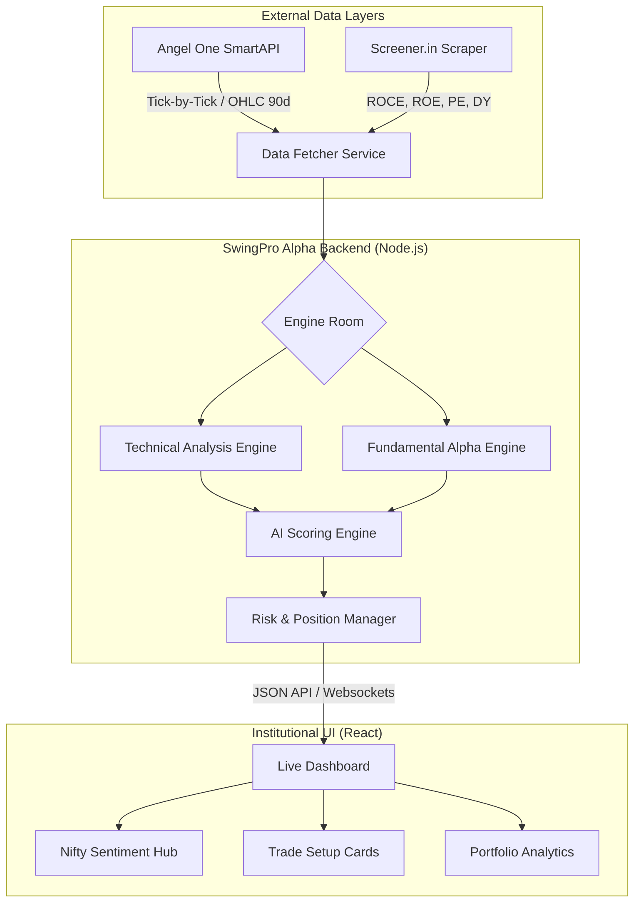

# 🚀 SwingPro — AI-Powered NSE Swing Trading Platform

<div align="center">

**Institutional-grade AI swing trading system for the Indian stock market**

[](https://nodejs.org/)
[](https://react.dev/)
[](https://vitejs.dev/)
[](https://smartapi.angelbroking.com/)

[Overview](#-overview) • [Architecture](#-architecture) • [AI Scoring](#-ai-scoring-engine) • [Risk Engine](#-risk--money-management) • [Hosting](#-hosting--deployment)

</div>

---

## 📸 Screenshots

### Dashboard — Dual-Mode (Stocks & ETFs)


### Portfolio Tracking & Sector Exposure


---

## ✨ Overview

SwingPro is a **professional-grade financial analytical platform** designed to identify high-probability swing trading setups (3–15 day horizon) in the NSE market. 

Unlike retail tools, SwingPro focuses on **Objective Rule-Based Trading**. It eliminates emotional bias by combining:
1.  **Multi-timeframe technical signals** from Angel One SmartAPI.
2.  **High-integrity fundamental metrics** scraped directly from Screener.in.
3.  **Hedge-fund-grade risk management** (Kelly-inspired position sizing).
4.  **AI-driven confidence scoring** to rank and prioritize trades.

---

## 🏗️ System Architecture

SwingPro uses a decoupled monolithic structure designed for low-latency analysis and robust data ingestion.



---

## 🧠 AI Scoring Engine

The heart of SwingPro is its **8-Factor Scoring System (0–100)**, which weights technical momentum against fundamental health and market context.

| Factor | Weight | Key Indicators Checked |
| :--- | :--- | :--- |
| **Trend Alignment** | 15% | EMA 20/50/200 Slope & Stacking |
| **Momentum** | 18% | RSI (14) Mean Reversion & MACD Crossovers |
| **Volume Profile** | 12% | Relative Volume (RVOL) vs 20-day Average |
| **Price Action** | 13% | Bollinger Band Squeezes & Horizontal Breakouts |
| **Risk-Reward** | 12% | Distance to Support vs Upside Target (Min 1:1.5) |
| **Psychology** | 10% | RSI Overextension & Day Change Dampening |
| **Fundamentals** | 10% | ROCE, Debt-to-Equity, and Revenue Growth |
| **Market Context**| 10% | Nifty 50 Trend & Institutional Hand-holding |

---

## 💰 Risk & Money Management

Capital preservation is the #1 priority. The engine enforces strict rules to prevent "blowing up" the account.

- **Capital Allocation**: Managed portfolio of ₹50,000 (standard local baseline).
- **Max Risk Per Trade**: Capped at **2.0%** of total capital.
- **Position Sizing**: Automatically calculated based on the distance between Entry and Stop Loss (ATR-adjusted).
- **Concentration Limit**: Max **20%** capital per trade and max **3 positions** per sector.
- **Dynamic Liquidity**: Maintains a **15% cash reserve** for emergency adjustments.

---

## 🚀 Hosting & Deployment

SwingPro is optimized for the following free-tier stack:

- **Frontend**: [Vercel](https://vercel.com) (Vite/React optimized).
- **Backend API**: [Render](https://render.com) (Free Tier Web Services).
- **Automation**: `totp-generator` handles Angel One 2FA automation during server-side login.
- **Deployment Strategy**: 
    - The backend uses a `render.yaml` configuration for zero-downtime deployment.
    - Frontend is deployed via GitHub CI/CD using the root `vercel.json`.

---

## 🛠️ Development Setup

### 1. Environment Configuration
Create a `.env` file in the root directory:
```env
# Angel One SmartAPI
API_KEY=your_key
CLIENT_ID=your_id
PIN=your_pin
TOTP_SECRET=your_16_char_secret

# Server Config
PORT=3001
NODE_ENV=development
```

### 2. Running Locally
```bash
# Install dependencies
npm install

# Start Alpha Backend
npm run server

# Start UI Dashboard
npm run dev
```

---

## ⚠️ Disclaimer
SwingPro is an **educational tool**. It does not provide financial advice. Trading in the Indian stock market involves significant risk. Always perform your own due diligence.

---

## 📄 License
MIT License - Copyright (c) 2024 Arindam Chowdhury.
