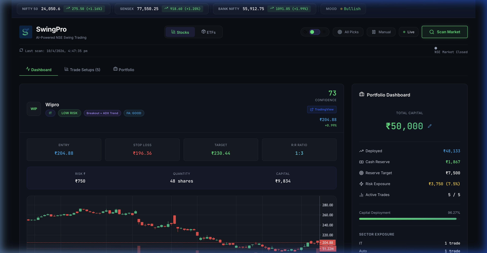
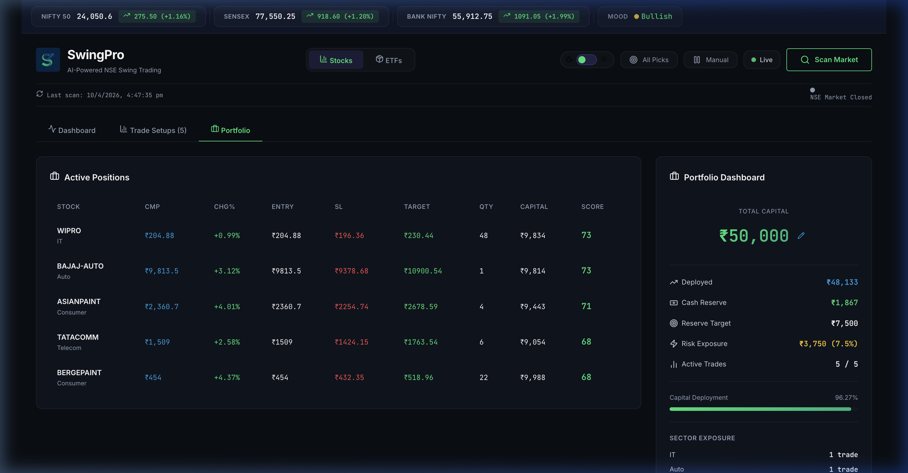

# 🚀 SwingPro — AI-Powered NSE Swing Trading Platform

<div align="center">

**Professional-grade AI swing trading system for the Indian stock market**

[](https://nodejs.org/)
[](https://react.dev/)
[](https://vitejs.dev/)
[](https://smartapi.angelbroking.com/)

</div>

---

## 📸 Screenshots

### Dashboard — Trade Setups with Full Analysis


### Portfolio Tracking & Sector Exposure


---

## ✨ What is SwingPro?

SwingPro is a **full-stack web platform** that acts as your personal AI trading analyst. Built to scan **50+ NSE Stocks and Top ETFs** using real-time data from **Angel One SmartAPI**, it runs multi-factor technical analysis, applies **hedge-fund-grade risk management**, and presents actionable swing trade setups (3–15 day horizon) through a beautiful dark-mode dashboard.

> **Think of it as a disciplined trading assistant that manages a ₹50,000 portfolio with professional risk rules — capital preservation first, profits second.**

---

## 🎯 Key Features

### 📡 Institutional-Grade Data (Angel One)
- **Live Tick Data:** Bypasses 15-minute delays by fetching live LTPs and full market depth directly from the NSE exchange.
- **Split-Adjusted History:** Perfectly maps 90-day OHLCV candles, adjusting for corporate actions (splits/bonuses) to prevent false technical indicators.
- **Auto-Refresh Scheduler:** Background server worker automatically fetches new data every 30 minutes during active NSE market hours (9:15 AM - 3:30 PM).

### 📊 Multi-Factor Analysis Engine
- **Technical**: RSI (14), MACD (12,26,9), EMA 20/50/200, ATR, Volume Analysis
- **Price Action**: Support/resistance detection, breakout & consolidation patterns, Bollinger Bands squeezing.
- **Asset Classes**: Seamlessly switch between **Stocks** and **ETFs** analysis.

### 💰 Professional Risk Management
| Rule | Value |
|------|-------|
| Max risk per trade | 1.5% of capital (₹750) |
| Position sizing | `Quantity = Risk Amount / (Entry − Stop Loss)` |
| Max concurrent trades | 5 |
| Cash reserve | 25% always in cash |
| Sector limit | Max 2 stocks per sector |
| Min risk-reward | 1:2 (prefers 1:2.5+) |

### 🧠 AI Confidence Scoring (0–100)
Six-factor weighted scoring system:

| Factor | Weight | What it measures |
|--------|--------|-----------------|
| Trend | 20% | EMA alignment, price above key MAs |
| Momentum | 20% | RSI zone, MACD crossovers, histogram slope |
| Volume | 15% | Volume ratio vs 20-day average |
| Price Action | 15% | Breakouts, support bounces, consolidation within Bollinger Bands |
| Risk-Reward | 15% | Quality of R:R ratio |
| Psychology | 15% | FOMO filter, overextension check, confirmation |

---

## 🏗️ System Architecture

SwingPro is built on a modern, decoupled Monolithic architecture optimized for high-throughput financial data processing and zero-latency technical analysis.

docs/screenshots/architecture.png

### 🧬 Tech Stack Overview

#### 1. Frontend (Presentation Layer)
- **Framework**: React 18 (Hooks-based architecture)
- **Build Tool**: Vite 5 (HMR & optimized production bundling)
- **Styling**: Vanilla CSS3 (Custom Glassmorphism design system, CSS Variables)

#### 2. Backend (API & Business Logic)
- **Runtime**: Node.js 18+
- **Framework**: Express.js (RESTful API routing & static file serving)
- **Authentication**: `totp-generator` (Dynamic 2FA bypass for active Angel One sessions)
- **Concurrency**: `Promise.all` batching with exponential backoff and chunked HTTP workers

#### 3. Data & Analytics (Alpha Engine)
- **Primary Data Provider**: Angel One SmartAPI (`smartapi-javascript` v1.0.27)
- **Technical Indicators**: `technicalindicators` library (SMA, EMA, RSI, MACD, ADX, ATR, Bollinger Bands)
- **Universe Caching**: Hardcoded symbol-token mapping layer for 100+ NSE constituents and ETFs

#### 4. Infrastructure & Deployment
- **Hosting**: Render.com (Unified Node.js Monolith deployment)
- **Routing**: SPA Catch-all (`app.get('*')` routing to static `dist/` folder)
- **Environment Management**: `dotenv` (API Keys, Client IDs, TOTP Secrets)

---

## 🔮 Future Enhancements (Roadmap)

To elevate SwingPro from a screener to a fully automated hedge-fund-grade AI, the following strategic upgrades are planned:

1. **Automated Backtesting Engine:**
   - Integrate a backtesting module that loops over 5 years of historical OHLCV data.
   - Run the current EMA + RSI + MACD strategy to calculate precise historical **Win Rates**, **Max Drawdown**, and **Sharpe Ratios**.
2. **Real-time WebSockets (L1 Data):**
   - Upgrade the backend to connect to Angel One's WebSocket streaming APIs.
   - Push tick-by-tick live prices directly to the React UI via Socket.io instead of relying on the 30-minute HTTP polling scheduler.
3. **Paper Trading Sandbox:**
   - Implement a virtual P&L tracker that automatically "buys" the selected trades and logs when stop-loss or targets are hit in real-time.
4. **Natural Language AI Querying:**
   - Integrate an LLM (like Gemini or OpenAI) to let users ask: *"Why didn't you pick HDFC Bank today?"* with the system parsing the historical logs to answer mathematically.

---

## 🚀 Quick Start (Local Run)

### 1. Generate Angel One Credentials
1. Create a free trading app at **[SmartAPI Angel One](https://smartapi.angelbroking.com/)** to get your `API Key`. Set Redirect URL to `http://127.0.0.1`.
2. Go to **[Enable TOTP](https://smartapi.angelbroking.com/enable-totp)**, enter your Client ID and MPIN, and save the 16-character authenticator secret.

### 2. Setup Project
```bash
# 1. Clone the repo
git clone https://github.com/YOUR_USERNAME/swing-stockpicker.git
cd swing-stockpicker

# 2. Install dependencies
npm install

# 3. Create environment variables
cp .env.example .env
```
Fill out the `.env` file with your Angel One credentials:
```env
ANGELONE_API_KEY=your_api_key
ANGELONE_CLIENT_ID=your_client_id
ANGELONE_PASSWORD=your_4_digit_mpin
ANGELONE_TOTP_SECRET=your_16_char_secret
PORT=3001
```

### 3. Run Application
You need **two terminals**:
```bash
# Terminal 1 — Start the backend API server
npm run server

# Terminal 2 — Start the frontend dev server
npm run dev
```
Open **http://localhost:5173** in your browser and click **"Scan Market"**.

---

## 🌐 Cloud Deployment (Render.com)

This application is configured for 1-click free deployment as a unified Monolith on **Render**.

1. Create an account on [Render.com](https://render.com).
2. Click **New +** → **Web Service** and connect your GitHub repository.
3. Configure the service:
   - **Branch**: `main`
   - **Build Command**: `npm run render-build` 
   - **Start Command**: `npm start`
4. Expand **Environment Variables** and add your 4 Angel One variables (`ANGELONE_API_KEY`, etc.).
5. Click **Create Web Service**. 

Render will automatically build the Vite static assets and start the Node.js server, exposing both the frontend UI and the backend API on a single secure public HTTPS URL.

---

## ⚠️ Disclaimer

> This software is for **educational and research purposes only**. It does not constitute financial advice. Trading in the stock market involves substantial risk of loss. Always do your own research and consult a qualified financial advisor before making any investment decisions. 

---

## 📄 License

MIT License — see [LICENSE](LICENSE) for details.
